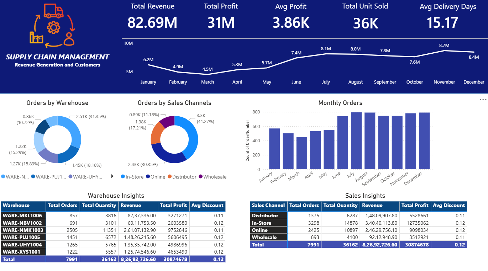

# Supply Chain Management Dashboard — Revenue Generation and Customers

## Overview

This project delivers an end-to-end supply chain analytics solution built in Power BI. The dashboard provides a unified view of revenue generation, profit performance, warehouse operations, and sales channel effectiveness. It is designed to help operations and business teams monitor key supply chain metrics, identify bottlenecks, and optimize inventory and delivery performance.

---

## Objectives

- Track total revenue, profit, and unit sales across the full supply chain
- Analyze warehouse-level performance to identify high-output and underperforming locations
- Evaluate sales channel contribution across In-Store, Online, Distributor, and Wholesale
- Monitor monthly order trends to detect seasonality and demand patterns
- Measure average delivery days as an operational efficiency indicator

---

## Dashboard Highlights

| Metric | Value |
|---|---|
| Total Revenue | 82.69M |
| Total Profit | 31M |
| Average Profit per Order | 3.86K |
| Total Units Sold | 36K |
| Average Delivery Days | 15.17 |
| Total Orders | 7,991 |

---

## Key Insights

- **Revenue Trend:** Monthly revenue dipped to a low of 4.5M in March before recovering steadily. Peak revenue was recorded in June at 8.1M and October at 8.7M, indicating strong mid-year and end-of-year demand cycles.

- **Warehouse Performance:** WARE-NMK1003 was the highest-performing warehouse with 2,505 orders, 11,351 units, and revenue of 2.61M. WARE-MKL1006 recorded the highest average order value despite fewer total orders (857), generating 87.37L in revenue with a profit of 32.71L.

- **Sales Channel Analysis:** Online was the dominant channel with 41.27% of total orders (3,300 orders), followed by In-Store at 30.35% (2,430 orders). Distributor and Wholesale channels together contributed approximately 28% of order volume. In-Store generated the highest revenue at 3.40M among all channels.

- **Monthly Orders:** Order volume showed a consistent upward trend from March through August, peaking in the July–October period with 750–800 orders per month. This suggests peak operational load during Q3 and early Q4.

- **Discount Strategy:** Average discount remained consistent at 0.11–0.12 across all warehouses and sales channels, indicating a standardized pricing policy across the supply chain.

- **Delivery Efficiency:** The average delivery time of 15.17 days across all channels presents an opportunity for operational improvement, particularly for the Online channel where customer expectations for faster delivery are higher.

---

## Tools and Technologies

- **Power BI Desktop** — Dashboard design, data modeling, and interactive reporting
- **Microsoft Excel** — Data preprocessing and cleaning
- **DAX (Data Analysis Expressions)** — Calculated measures for revenue, profit, and order aggregations

---

## Visualizations Included

- KPI Cards for Total Revenue, Total Profit, Average Profit, Total Units Sold, and Average Delivery Days
- Line Chart for Monthly Revenue Trend (January to December)
- Donut Chart for Orders by Warehouse distribution
- Donut Chart for Orders by Sales Channel distribution
- Bar Chart for Monthly Order Count
- Detailed Table — Warehouse Insights (Orders, Quantity, Revenue, Profit, Discount)
- Detailed Table — Sales Channel Insights (Orders, Quantity, Revenue, Profit, Discount)

---

## Dataset

- **Domain:** Supply Chain and Retail Operations
- **Records:** 7,991 orders across 6 warehouses and 4 sales channels
- **Key Fields:** Warehouse ID, Sales Channel, Order Number, Order Date, Revenue, Profit, Quantity, Discount, Delivery Days

---

## Project Structure

```
Supply-Chain-Management/
│
├── SupplyChain_Dashboard.pbix         # Power BI report file
├── dashboard_screenshot.png           # Dashboard preview image
└── README.md                          # Project documentation
```

---

## Dashboard Preview



---

## Author

**Tharun Kumar Srinivasan**  
Aspiring Data Analyst | Power BI | SQL | Python  
[LinkedIn](https://www.linkedin.com/in/tharunkumarsrini/) | [GitHub](https://github.com/Tharun-Design)

---

## License

This project is intended for educational and portfolio purposes only. The dataset used does not represent any proprietary or confidential business data.
